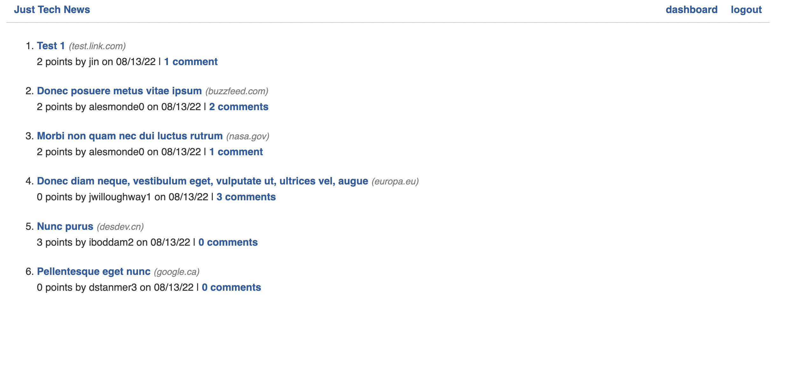

# python-newsfeed

## Description

A website where users can post, upvote, and comment on links to news articles. This website is built with Python, Flask, SQLAlchemy, Jinja2, PyMySQL, and Javascript, and deployed to heroku.

## Built with

- JavaScript
- Python
- Flask
- Gunicorn
- SQLAlchemy
- bcrypt
- Jinja2
- PyMySQL
- dotenv
- Heroku

## Deployed application

https://python-news-fd.herokuapp.com/

## Installation

```
pip install
flask
sqlalchemy
pymysql
python-dotenv
bcrypt
cryptography
```

## Screenshot



## Questions

Find me on GitHub
infinissible
repo: https://github.com/infinissible

Email me with any questions
infinissible@gmail.com
